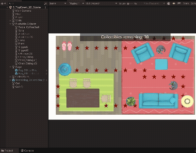

# Unity Showcase

## Project: Kids Playroom

## 🧠 What I Learned

### 🧭 Navigating 3D Space

- Moved around using the **Scene View** tools (hand tool, move, rotate, scale)
- Practiced zooming, orbiting, and panning
- Used the **gizmo** and **scene axes** to reorient the camera

### 🧱 Working with GameObjects

- Placed and manipulated **3D primitives** (cubes, spheres, cylinders)
- Used **Move, Rotate, and Scale tools** on objects
- Snapped objects to the ground for better alignment

### 💡 Scene Composition

- Learned how to duplicate objects to fill the room quickly
- Aligned and spaced objects to create a balanced layout
- Used colors and shapes to add visual variety

### 🛠 Tools & Components Used

- Scene View
- Move / Rotate / Scale tools
- 3D Primitives (Cube, Sphere, etc.)
- Inspector and Hierarchy windows
- Scene Gizmo
- Physics (rigidbody & colliders)

---

## Project: Ktichen & Sounds

## 🧠 What I Learned

### 🔊 Audio Basics

- Added **Audio Sources** to objects
- Used the **Audio Listener** to simulate the player's ears
- Learned how to loop background music and adjust volume

### 🌐 3D Spatial Sound

- Enabled **Spatial Blend** for 3D positional audio
- Adjusted **Min/Max distance** for sound attenuation
- Noticed how sound changes based on the listener's position

### 🌀 Environmental Audio

- Applied a randomizer script for bird sound sources
- Created more realistic environments with subtle sound variations

### 🛠 Tools & Components Used

- `AudioSource`
- `AudioListener`
- Audio clips (looping, SFX)
- Spatial Blend, Volume balancing

---

## Project: Player # Collectibles

## 🧠 What I Learned

### 🎮 Movement & Input

- Added a **movement script** to control a character (A UFO) around the scene
- Learned to read input and apply it to a GameObject's transform

### 🧩 Interactivity

- Created a **rotating collectible** and programmed the character to **collect** it on contact
- Used collision detection and triggers to trigger VFXs upon collision

### 📌 Scene & Camera Control

- Adjusted the **camera** to follow the player
- Managed GameObject activation/deactivation through scripting

### 🛠 Tools & Concepts Used

- C# scripts
- Core programming: variables, conditionals, classes and objects
- Unity API: `OnTriggerEnter`, `Input.GetAxis`, `Instantiate`
- Editor: linking scripts to GameObjects and components in the inspector

## Project 2D Room Maze

## 🧠 What I Learned

### 🧭 Navigating & Building in 2D

- Moved and positioned GameObjects in the **2D Scene View**
- Imported and placed **Sprite assets** for characters and items

### 🎯 Interactivity & Physics

- Scripted movement for a player-controlled character in 2D
- Used **2D collision detection** and physics to enable object collection
- Adjusted parameters such mass, gravity scale, linear damping and angular damping to simulate realistic physics

### 🛠 Scene Setup & Components

- Organized sprites and GameObjects into a cohesive 2D scene
- Applied basic physics components (RigidBody2D, Collider2D) to interactive elements
- Created a simple animated sprite using Unity's sprite editor

### 🛠 Tools & Concepts Used

- **Sprite Renderer**, **Rigidbody2D**, **Collider2D**
- C# scripts using `MonoBehaviour` for movement and interaction
- Unity Editor’s 2D-specific tools (Scene View, asset browser)
