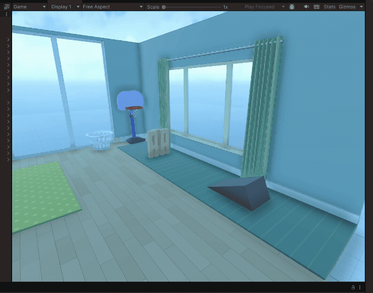
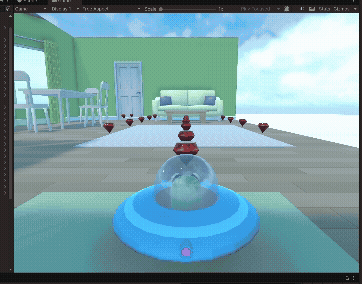
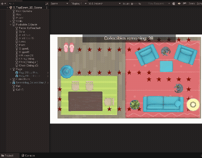

# Unity Showcase

A collection of small Unity scenes I built while working through the fundamentals of the engine — 3D layout, audio, scripting, physics, and 2D. Each project focuses on a specific area, with a short note on what it taught me and which Unity systems it uses.

## Contents

| Scene | Focus |
| --- | --- |
| [Kids Playroom](#kids-playroom) | 3D scene composition and primitives |
| [Kitchen & Sounds](#kitchen--sounds) | Spatial audio and `AudioSource` setup |
| [Player & Collectibles](#player--collectibles) | C# scripting, input, and triggers |
| [2D Room Maze](#2d-room-maze) | Sprites, 2D physics, and colliders |

---

## Kids Playroom

A small 3D room arranged from primitive shapes, used as practice for laying out a scene and getting comfortable navigating the editor.

**What I built**
- A playroom assembled from cubes, spheres, and cylinders, with objects duplicated and spaced to give the room some structure.
- A ball-tower setup that uses Rigidbody and colliders so the stack reacts when nudged.

**Unity systems**
Scene View navigation · 3D primitives · Transform tools · Rigidbody + colliders · Inspector / Hierarchy

---

## Kitchen & Sounds

A kitchen scene focused on audio: making sound feel like it belongs in the space rather than just playing on top of it.

**What I built**
- Looping ambient music plus localized `AudioSource` clips on individual props.
- Spatial blend tuned so sounds attenuate naturally as the listener moves.
- A small randomizer script that varies bird SFX timing so the ambience doesn't feel mechanical.

**Unity systems**
`AudioSource` · `AudioListener` · Spatial Blend / Min–Max distance · C# scripting for randomization

---

## Player & Collectibles

A controllable UFO that flies around a room, picks up rotating collectibles, and triggers VFX on contact.

**What I built**
- A movement script driven by `Input.GetAxis` that translates the player each frame.
- Collectibles that rotate in place and disappear on trigger overlap, spawning a particle effect.
- A camera that follows the player so the scene stays framed during movement.

**Unity systems**
C# `MonoBehaviour` scripts · `Input.GetAxis` · `OnTriggerEnter` · `Instantiate` · Camera follow

---

## 2D Room Maze

A top-down 2D scene where a sprite character moves through a room and collects items, with physics tuned to feel responsive rather than floaty.

**What I built**
- Sprite-based player and pickups laid out in a 2D scene.
- 2D movement script with collision detection against walls and triggers for collectibles.
- Physics parameters (mass, gravity scale, linear and angular damping) tuned so motion feels intentional.
- A simple frame-based sprite animation using Unity's sprite editor.

**Unity systems**
`SpriteRenderer` · `Rigidbody2D` · `Collider2D` · 2D Scene View · Sprite Editor

---

## Running it

Open the project in Unity (the version is pinned in `ProjectSettings/ProjectVersion.txt`). The scenes live under [Assets/_Unity Essentials/Scenes/](Assets/_Unity%20Essentials/Scenes/), with a main menu scene (`0_MainMenu_Scene`) that links to each of the projects above.

WebGL builds are also included in [WebGL Builds/](WebGL%20Builds/) if you'd rather not open the editor.
