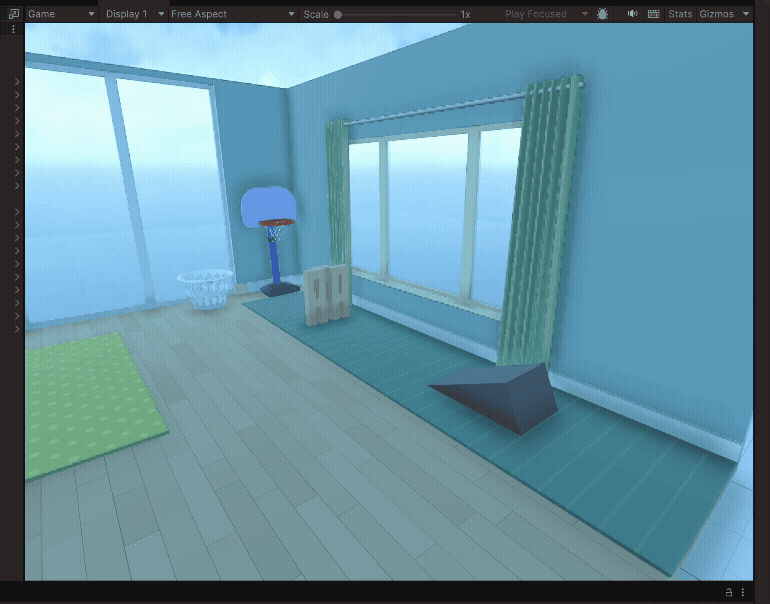

# Unity Showcase

## Project: Kids Playroom

## 🧠 What I Learned

### 🧭 Navigating 3D Space

- Moved around using the **Scene View** tools (hand tool, move, rotate, scale)
- Practiced zooming, orbiting, and panning
- Used the **gizmo** and **scene axes** to reorient the camera

### 🧱 Working with GameObjects

- Placed and manipulated **3D primitives** (cubes, spheres, cylinders)
- Used **Move, Rotate, and Scale tools** on objects
- Snapped objects to the ground for better alignment

### 💡 Scene Composition

- Learned how to duplicate objects to fill the room quickly
- Aligned and spaced objects to create a balanced layout
- Used colors and shapes to add visual variety

---

## 🛠 Tools & Components Used

- Scene View
- Move / Rotate / Scale tools
- 3D Primitives (Cube, Sphere, etc.)
- Inspector and Hierarchy windows
- Scene Gizmo
- Physics (rigidbody & colliders)

---

## ✅ Completion

- ✔️ Completed the Kids Playroom project
- ✔️ Gained confidence in navigating Unity’s 3D workspace
- ✔️ Prepared for more advanced level design

## Project: Ktichen & Sounds

## 🧠 What I Learned

### 🔊 Audio Basics

- Added **Audio Sources** to objects
- Used the **Audio Listener** to simulate the player's ears
- Learned how to loop background music and adjust volume

### 🌐 3D Spatial Sound

- Enabled **Spatial Blend** for 3D positional audio
- Adjusted **Min/Max distance** for sound attenuation
- Noticed how sound changes based on the listener's position

### 🌀 Environmental Audio

- Applied a randomizer script for bird sound sources
- Created more realistic environments with subtle sound variations

---

## 🛠 Tools & Components Used

- `AudioSource`
- `AudioListener`
- Audio clips (looping, SFX)
- Spatial Blend, Volume balancing

---

## ✅ Completion

- ✔️ Completed the Audio Essentials unit
- ✔️ Earned experience in Unity’s audio system
- ✔️ Prepared to use sound design in future scenes
